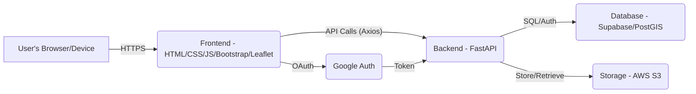

# Proposed Technical Plan: LocalPhoto App

**1. Architecture Overview**

We'll build a standard client-server architecture:

*   **Frontend:** A mobile-first Single Page Application (SPA) using HTML, CSS (Bootstrap), and JavaScript. It will handle user interaction, display data, and communicate with the backend via API calls (Axios). Leaflet.js will be used for the interactive map.
*   **Backend:** A RESTful API built with FastAPI (Python). It will manage business logic, user authentication, database interactions, and communication with external services (AWS S3).
*   **Database:** Supabase (PostgreSQL with PostGIS extension) will store user data, image metadata, and geospatial information.
*   **Storage:** AWS S3 will store the uploaded image files.

**2. Backend Details (FastAPI)**

*   **Project Setup:**
    *   Create a `backend` directory.
    *   Initialize a FastAPI project within `backend`.
    *   Configure CORS, set up environment variables (`.env`) for Supabase URL/Key, AWS S3 credentials, and JWT secret.
    *   Integrate Supabase client library (`supabase-py`) and AWS SDK (`boto3`).
*   **Authentication:**
    *   Implement email/password registration with password hashing (`passlib`).
    *   Implement JWT generation upon login and middleware/dependency to verify JWT tokens on protected endpoints (`python-jose`).
    *   Integrate Google OAuth2 flow.
*   **Database Models (using SQLModel or SQLAlchemy):**
    *   `User`: `id`, `email`, `hashed_password`, `google_id` (optional), `avatar_url`, `home_location` (GeoAlchemy2 `Geometry(geometry_type='POINT', srid=4326)`), `default_radius_km`.
    *   `ImageSubmission`: `id`, `user_id` (ForeignKey), `image_url` (S3 URL), `description`, `location` (GeoAlchemy2 `Geometry(geometry_type='POINT', srid=4326)`), `uploaded_at`, `expires_at`, `thumbs_up_count`, `thumbs_down_count`, `is_locked`.
    *   Use Alembic for database migrations.
*   **API Endpoints (structure within routers):**
    *   `/auth`: `/register`, `/login`, `/google`, `/google/callback`
    *   `/users`: `/me` (GET, PUT), `/me/submissions` (GET)
    *   `/submissions`: `/` (POST), `/nearby` (GET), `/{submission_id}` (GET, PUT, DELETE), `/{submission_id}/thumbs_up` (POST), `/{submission_id}/thumbs_down` (POST)
*   **Core Logic:**
    *   **Image Upload:** Handle file upload (`python-multipart`), extract GPS (frontend preferred, fallback backend), upload to S3, save metadata to Supabase, calculate `expires_at` (now + 3 days), set `is_locked` to false. Schedule lock task.
    *   **Locking:** Use FastAPI `BackgroundTasks` or a simple timestamp check in the PUT endpoint to enforce the 10-minute edit window. Update `is_locked` flag or derive state from `uploaded_at`.
    *   **Expiration:** Filter results in `/submissions/nearby` based on `expires_at`. Optional: Add a scheduled cleanup task (Supabase function or external cron).
    *   **Nearby Query:** Use PostGIS `ST_DWithin` function in the Supabase query.
    *   **Thumbs Up/Down:** Increment counters. Consider tracking users who voted to prevent duplicates.

**3. Frontend Details (HTML/CSS/JS)**

*   **Project Setup:**
    *   Create a `frontend` directory.
    *   Structure: `index.html` (acts as entry/router), `css/style.css`, `js/main.js`, `js/api.js`, `js/auth.js`, `js/map.js`, `js/profile.js`, `js/submit.js`, `views/` (HTML templates/partials for different pages).
*   **Styling:** Use Bootstrap 5 for layout, components, and responsiveness. Custom CSS for branding/theming.
*   **Map Page (Leaflet):**
    *   Initialize map, center on user's current location (HTML5 Geolocation) or home location.
    *   Fetch nearby images via `/submissions/nearby`.
    *   Display markers with popups (thumbnail, description, thumbs up/down buttons).
    *   Radius slider/input updating the API call dynamically.
    *   Map interaction for setting home location.
*   **Submission Page:**
    *   Form with file input (`capture="environment"`), description textarea.
    *   Use Geolocation API for camera uploads.
    *   Use `exif-js` (or similar) to parse EXIF GPS for gallery uploads.
    *   Submit data via Axios POST to `/submissions`.
    *   Handle edit state/timer based on submission `uploaded_at` time.
*   **Profile Page:**
    *   Fetch/display user data and submissions.
    *   Allow editing/deleting submissions based on lock status/time.
    *   Allow updating profile settings.
*   **Authentication:**
    *   Login/Register forms.
    *   Handle API calls for auth, store JWT in `localStorage`.
    *   Use Axios interceptors for adding Auth header.
    *   Client-side routing (simple hash-based or using a library like Navigo).
*   **State Management:** Keep it simple initially; pass data or re-fetch as needed.

**4. Development Workflow & Tooling**

*   **Backend:** Use `poetry` for dependency management. Use `uvicorn` for local development server with hot-reloading. Use `pytest` for testing.
*   **Frontend:** Use a simple live server for development (e.g., VS Code Live Server extension or `python -m http.server`). No complex build step initially.
*   **Version Control:** Initialize a Git repository in the root directory (`/Users/hmarquardt/localphoto`). Create `.gitignore` files for `hm_venv`, `.env`, `__pycache__`, etc.

**5. Next Steps (Implementation Order)**

1.  Setup Git repository.
2.  Setup Backend: Project structure, dependencies, basic FastAPI app, `.env` config.
3.  Backend: Database models and migrations (Alembic).
4.  Backend: Authentication (JWT, email/password register/login).
5.  Frontend: Basic structure, routing, Login/Register pages, Auth API integration.
6.  Backend: Image submission endpoint (POST /submissions) including S3 upload and DB save (basic version).
7.  Frontend: Submission page (form, basic image handling, API call).
8.  Backend: Nearby submissions endpoint (GET /submissions/nearby) with PostGIS.
9.  Frontend: Map page (Leaflet setup, API call, display markers).
10. Backend: User profile endpoints.
11. Frontend: Profile page.
12. Backend/Frontend: Implement remaining features (Google OAuth, edit/delete, locking, expiration filtering, thumbs up/down, radius filter, home location).
13. Testing: Add backend tests, perform manual frontend testing.
14. Deployment: Configure hosting.